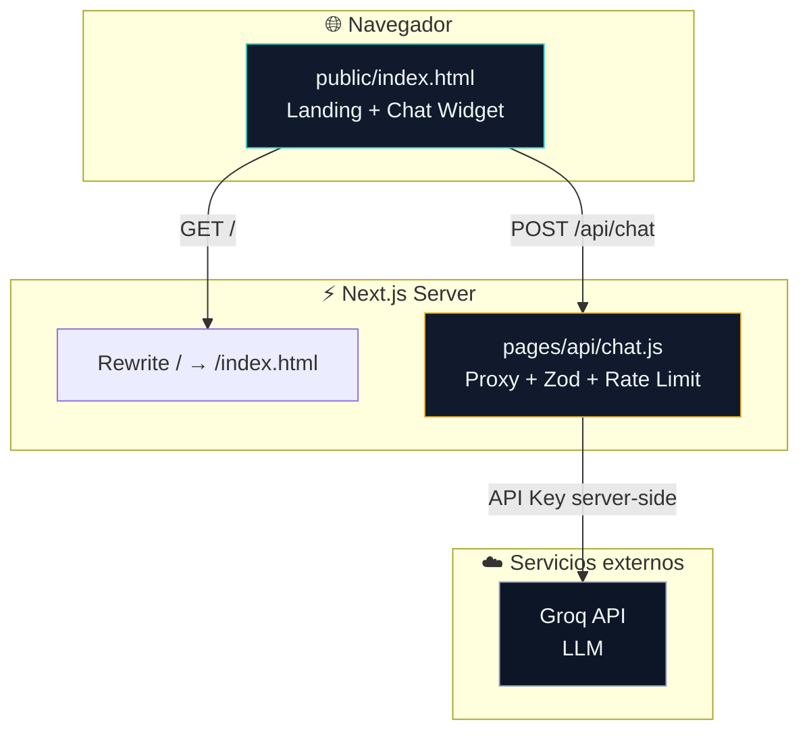
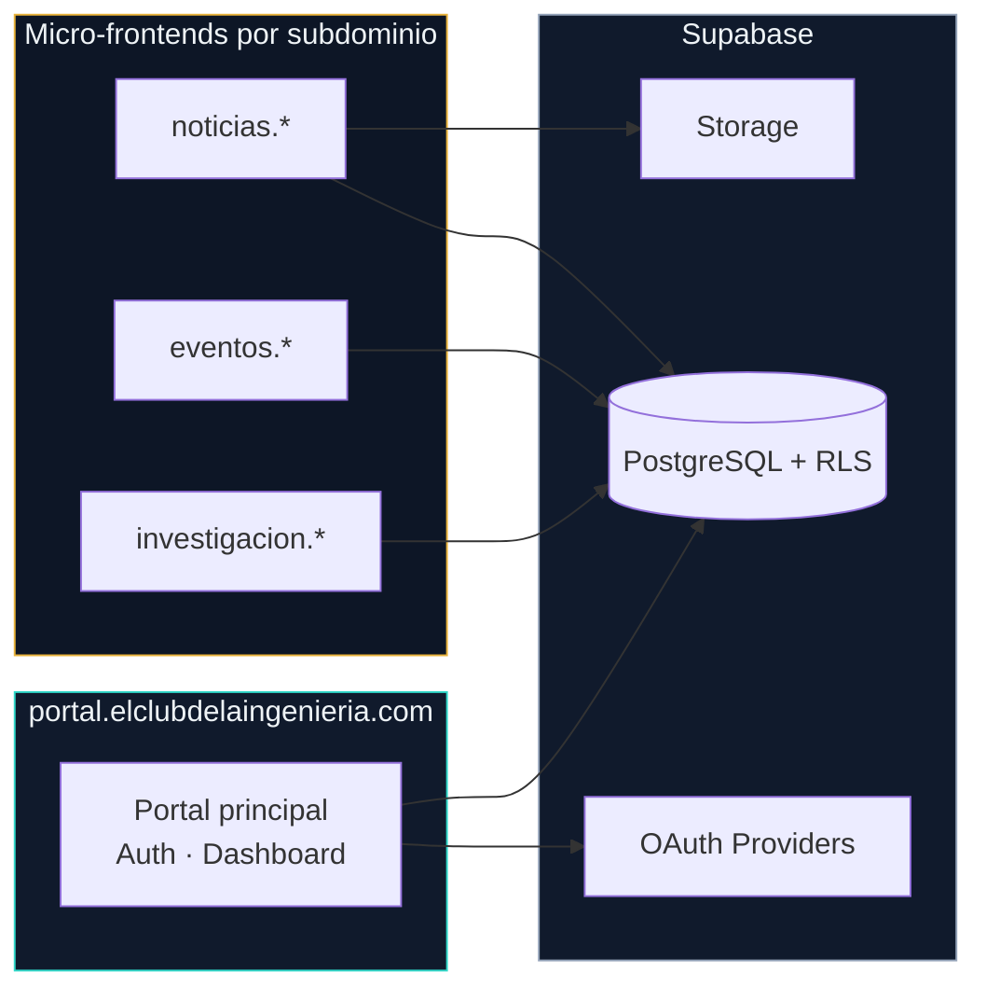
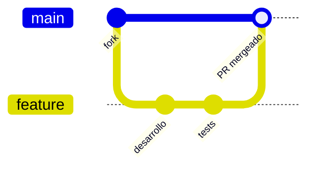

<div align="center">


# El Club de la Ingeniería

### *Innovando el futuro desde Tecnologías de la Información, Ciencias e Investigación*

[](https://nextjs.org/)
[](https://react.dev/)
[](https://nodejs.org/)
[](https://vercel.com/)
[](LICENSE)
[](https://github.com/IngMarlonPerez/El-Club-de-la-Ingenier-a)

**Comunidad universitaria · Proyectos reales · Aprendizaje colaborativo · IA integrada**

[Explorar el código](#-inicio-rápido) · [Ver arquitectura](#-arquitectura) · [Roadmap](#-roadmap) · [Contribuir](#-contribuir)


</div>

---

## 📋 Tabla de contenidos

<details open>
<summary><strong>Mostrar / ocultar índice</strong></summary>

- [Acerca del proyecto](#-acerca-del-proyecto)
- [Características](#-características)
- [Stack tecnológico](#-stack-tecnológico)
- [Arquitectura](#-arquitectura)
- [Inicio rápido](#-inicio-rápido)
- [Variables de entorno](#-variables-de-entorno)
- [Estructura del repositorio](#-estructura-del-repositorio)
- [API del asistente IA y Sistema Multiproveedor](#-api-del-asistente-ia-y-sistema-multiproveedor)
- [Reto Terminal Linux](#-reto-terminal-linux-operación-laboratorio-b)
- [Roadmap](#-roadmap)
- [Seguridad](#-seguridad)
- [Contribuir](#-contribuir)
- [Contacto](#-contacto)
- [Licencia](#-licencia)


</details>

---

## 🎯 Acerca del proyecto

**El Club de la Ingeniería** es la plataforma web oficial del **Club de Ingeniería en Tecnologías de la Información, Ciencias e Investigación** — una comunidad universitaria fundada en **2016** en el **Taller-B, Facultad de Ingeniería**, abierta a estudiantes de todas las carreras.

> *No se necesita experiencia previa para unirse. Solo curiosidad, ganas de aprender y construir.*

Este repositorio evoluciona desde un **MVP funcional** hacia una **plataforma modular con micro-frontends por subdominio**, donde cada plantilla (noticias, eventos, investigación) puede desplegarse de forma independiente.

<table>
<tr>
<td width="50%">

### 🧭 Misión

Conectar estudiantes y profesionales de TI para **aprender haciendo**: proyectos reales, mentoría entre pares y difusión de ciencia y tecnología.

</td>
<td width="50%">

### 🔭 Visión

Ser la plataforma de referencia del club: identidad digital, contenido especializado y herramientas que escalen con la comunidad.

</td>
</tr>
</table>

### Áreas técnicas del club

| Área | Enfoque |
|:-----|:--------|
| 💻 **Desarrollo de software** | Aplicaciones web, APIs, buenas prácticas |
| 🤖 **Ciencia de datos e IA** | ML, análisis, asistentes inteligentes |
| 🔐 **Ciberseguridad** | OWASP, hardening, auditoría |
| ☁️ **Redes y cloud** | Infraestructura, despliegue, DevOps |
| 📊 **Sistemas de información** | Modelado, procesos, arquitectura |
| 🔬 **Investigación aplicada** | Proyectos con impacto académico y social |

---

## ✨ Características

<table>
<tr>
<td align="center" width="33%">
<h3>🖥️ Landing retro</h3>
Boot animado estilo Macintosh en <strong>CSS puro</strong>, efecto Matrix y experiencia inmersiva al entrar al sitio.
</td>
<td align="center" width="33%">
<h3>🤖 Asistente IA y Voz</h3>
Chat con <strong>Groq/NVIDIA</strong> (respaldo automático), síntesis de voz (Web Speech API) y holograma reactivo (GSAP).
</td>
<td align="center" width="33%">
<h3>⚡ Next.js híbrido</h3>
Landing estática preservada + API Routes. Sin reescribir el DOM manual en React.
</td>
</tr>
<tr>
<td align="center">
<h3>📱 Responsive</h3>
Diseño fluido de móvil a Smart TV/monitor grande, con tipografía IBM Plex y paleta teal/gold sobre dark mode.
</td>
<td align="center">
<h3>🛡️ Seguridad</h3>
API keys solo en servidor. Validación de entrada. Límites anti-abuso por IP.
</td>
<td align="center">
<h3>🚀 Deploy-ready</h3>
Preparado para <strong>Vercel</strong> con configuración mínima y variables de entorno documentadas.
</td>
</tr>
<tr>
<td align="center" colspan="3">
<h3>🎮 Reto Terminal Linux con INGenioso</h3>
<strong>Operación Laboratorio-B</strong>: aprende comandos reales de Linux jugando dentro de una computadora retro (el mismo diseño del boot), con <strong>INGenioso</strong> — un oso cyborg asistido por IA — guiándote paso a paso en un único input. 248 etapas secuenciales de dificultad creciente repartidas en 31 niveles —de reconocimiento a una auditoría de datacenter y nube que rescata a una universidad ficticia— (~13 horas), 100% simulado y ficticio.
</td>
</tr>
</table>

<br />

<details>
<summary><strong>🔍 Ver detalle de secciones del sitio</strong></summary>

| Sección | Descripción |
|:--------|:------------|
| **Hero** | Presentación del club con CTA para unirse |
| **Proyectos** | Portafolio de iniciativas del club |
| **Equipo** | Miembros y roles |
| **Medios** | Enlaces a redes y contenido |
| **Unirse** | Formulario de contacto / membresía |
| **Chat IA** | Widget flotante con contexto del club |

</details>

---

## 🛠 Stack tecnológico

<div align="center">

| Capa | Tecnología | Estado |
|:-----|:-----------|:------:|
| **Frontend** | HTML5 · CSS3 · JavaScript vanilla | ✅ Activo |
| **Framework** | Next.js 16 (Pages Router) | ✅ Activo |
| **UI Runtime** | React 19 | ✅ Activo |
| **Validación** | Zod | ✅ Activo |
| **IA** | Groq API + NVIDIA NIM (Respaldo) | ✅ Activo |
| **Base de datos** | Supabase (PostgreSQL + RLS) | ⚠️ En desarrollo (Migraciones creadas) |
| **Animaciones** | GSAP (GreenSock) | ✅ Activo |
| **Multimedia** | Web Speech API (Síntesis de voz) | ✅ Activo |
| **Auth** | OAuth — Google · GitHub · Facebook | 🔜 Planificado |
| **Monorepo** | Turborepo + pnpm workspaces | 🔜 Planificado |
| **CI/CD** | GitHub Actions + Vercel | 🔜 Planificado |
| **Observabilidad** | Sentry · Vercel Analytics | 🔜 Planificado |

</div>

<p align="center">
  
</p>

---

## 🏗 Arquitectura

### Estado actual (MVP)



### Visión futura (roadmap)



<details>
<summary><strong>📐 Principios de diseño arquitectónico</strong></summary>

- **Micro-frontends Jamstack** — independencia de despliegue sin complejidad de Kubernetes
- **Multi-tenant con RLS** — cada template aislado a nivel de datos
- **Serverless first** — Next.js Route Handlers + Supabase Edge Functions
- **Seguridad en profundidad** — OWASP, CSP, rate limiting, secretos fuera del repo
- **Clonabilidad** — nueva plantilla = copiar `_template-base` + config + subdominio en < 1 día

</details>

---

## 🚀 Inicio rápido

### Prerrequisitos

```text
Node.js 18+     →  https://nodejs.org/
npm o pnpm      →  gestor de paquetes
Cuenta Groq     →  https://console.groq.com/  (para el chat IA)
```

### 1 · Clonar el repositorio

```bash
git clone https://github.com/IngMarlonPerez/El-Club-de-la-Ingenier-a.git
cd El-Club-de-la-Ingenier-a
```

### 2 · Instalar dependencias

```bash
npm install
```

### 3 · Configurar variables de entorno

```bash
cp .env.local.example .env.local
```

Edita `.env.local` y agrega tu clave de Groq.

### 4 · Ejecutar en desarrollo

```bash
npm run dev
```

Abre **[http://localhost:3000](http://localhost:3000)** en tu navegador.

### 5 · Build de producción

```bash
npm run build
npm start
```

<details>
<summary><strong>☁️ Desplegar en Vercel (recomendado)</strong></summary>

1. Importa el repositorio en [vercel.com/new](https://vercel.com/new)
2. Framework preset: **Next.js**
3. Agrega la variable de entorno `GROQ_API_KEY` en el panel de Vercel
4. Deploy → tu sitio estará en `*.vercel.app`

> **Importante:** nunca subas `.env.local` al repositorio. Usa variables de entorno del hosting.

</details>

---

## 🔐 Variables de entorno

| Variable | Requerida | Descripción |
|:---------|:---------:|:------------|
| `GROQ_API_KEY` | ✅ | Clave de API de Groq para el asistente de chat (Proveedor Principal) |
| `NVIDIA_API_KEY` | ❌ | Clave de API de NVIDIA NIM (Proveedor de Respaldo) |
| `GROQ_DAILY_LIMIT` | ❌ | Límite diario de mensajes para Groq (Por defecto: 500) |
| `NVIDIA_DAILY_LIMIT` | ❌ | Límite diario de mensajes para NVIDIA (Por defecto: 300) |
| `SUPABASE_URL` | ⚠️ | URL del proyecto Supabase (para tracking de cuotas e integrantes) |
| `SUPABASE_ANON_KEY` | ⚠️ | Clave pública Anon de Supabase |
| `SUPABASE_SERVICE_ROLE_KEY` | ⚠️ | Clave de rol de servicio (privada) para bypass RLS en backend |

```env
# .env.local
GROQ_API_KEY=tu_clave_de_groq_aqui
NVIDIA_API_KEY=tu_clave_de_nvidia_aqui
GROQ_DAILY_LIMIT=500
NVIDIA_DAILY_LIMIT=300
SUPABASE_URL=https://tu-proyecto.supabase.co
SUPABASE_ANON_KEY=sb_publishable_xxxxxxxx
SUPABASE_SERVICE_ROLE_KEY=tu_service_role_key_aqui
```

---

## 📁 Estructura del repositorio

```
El-Club-de-la-Ingenier-a/
│
├── 📂 public/                  # Assets estáticos servidos por Next.js
│   ├── index.html              # Landing completa con holograma interactivo y widget de voz
│   ├── linux-cli.html          # Reto educativo de terminal Linux interactivo
│   ├── hero-banner.jpg         # Banner principal
│   └── logo.jpg                # Logo del club
│
├── 📂 pages/
│   └── 📂 api/
│       └── chat.js             # Proxy IA multianfitrión (Groq/NVIDIA) + cuota Supabase
│
├── 📂 supabase/
│   └── 📂 migrations/          # Migraciones de base de datos SQL
│       ├── 0001_auth_and_members.sql
│       └── 0002_ia_uso_diario.sql   # Tabla y función RPC para control de cuota de IA
│
├── 📄 next.config.js           # Rewrite / → index.html
├── 📄 package.json             # Dependencias y scripts
├── 📄 .env.local.example       # Plantilla de variables de entorno
├── 📄 .gitignore               # Excluye node_modules, .next, .env*
├── 📄 CLAUDE.md                # Contexto de ingeniería para IA dev tools
└── 📄 README.md                # Este archivo
```

---

## 🤖 API del asistente IA y Sistema Multiproveedor

El endpoint `/api/chat` actúa como **proxy seguro** e inteligente entre el frontend y las APIs de LLM de Groq y NVIDIA NIM.

| Aspecto | Detalle |
|:--------|:--------|
| **Método** | `POST` |
| **Modelos de IA** | Primario: Groq (`llama-3.1-8b-instant`) <br> Respaldo: NVIDIA NIM (`llama-3.1-nemotron-70b-instruct`) |
| **Control de Cuota** | Registro diario de mensajes en Supabase (`ia_uso_diario`) para control estricto de cuota gratuita. |
| **Voz & UI** | Síntesis de voz interactiva mediante Web Speech API y visualización holográfica reactiva por GSAP. |
| **Validación** | Zod — roles `user`/`assistant`, máx. 20 mensajes, 1000 chars c/u |
| **Rate limit** | 12 solicitudes / minuto / IP (en memoria) |
| **Seguridad** | API Keys y Service Role Key nunca expuestas al cliente |
| **Contexto** | System prompt optimizado con misión, visión y enlaces oficiales del club |

```bash
# Ejemplo de solicitud
curl -X POST http://localhost:3000/api/chat \
  -H "Content-Type: application/json" \
  -d '{"messages":[{"role":"user","content":"¿Cómo me uno al club?"}]}'
```

## 🎮 Reto Terminal Linux (Operación Laboratorio-B)

Un entorno de terminal Linux 100% simulado y educativo, accesible desde [`/linux-cli.html`](public/linux-cli.html), pensado para que cualquier persona —incluso sin experiencia previa— aprenda comandos reales de la mano de **INGenioso**, un oso cyborg asistente con IA.

**Cómo está armado:**

- **La computadora es la pantalla del juego.** Reutiliza el mismo componente visual de la computadora retro "todo en uno" de la animación de arranque del sitio (`.mac-unit`): el mismo chasis, bisel y brillo de fósforo verde, ahora como el terminal donde corre la partida.
- **Un solo input para todo.** No hay una caja de comandos y otra de chat separadas: escribes un comando real (se ejecuta contra el simulador) o le preguntas algo en lenguaje natural a INGenioso ("no sé qué hacer", "dame una pista") y él responde — el propio input decide a quién hablarle según lo que escribas.
- **Progresión secuencial de dificultad**, 8 etapas por nivel con barra de progreso visible, en 31 niveles (248 etapas en total, ~13 horas de contenido):
  - **Nivel 1 — Reconocimiento:** `pwd` → `ls` → `ls -a` → `cat readme.txt` → `cat briefing.txt` (revela el objetivo) → `ping` → `nmap` → `nmap -sV` (revela la vulnerabilidad).
  - **Nivel 2 — Infiltración WiFi:** `iwconfig` → `airmon-ng start` → `airodump-ng` → captura dirigida → `aireplay-ng --deauth` (con recordatorio ético explícito) → confirmación del handshake → `cat wordlist.txt` → `aircrack-ng` (contraseña final, pista conectada al Nivel 1).
  - **Nivel 3 — Comunicación Segura:** `ssh-keygen` → `ssh-copy-id` → `ssh` → `gpg --gen-key` → `gpg --encrypt` → `wg genkey` → `wg-quick up` → `wg show` — cifrado y autenticación reales, no "invisibilidad".
  - **Nivel 4 — Detección:** `netstat`/`ss` → `ps aux` → `lsof -p` → `cat auth.log` → `tcpdump` → `sha256sum` → contraste con inteligencia de amenazas → informe de incidente — el sombrero defensor, encontrar lo que el Nivel 3 enseñó a proteger.
  - **Nivel 5 — Respuesta a Incidentes:** aislar (`ip link down`) → `kill` → eliminar binario → revisar y limpiar persistencia (`crontab`) → parchar (`apt upgrade`) → reconectar → verificar — ciclo de contención/erradicación/recuperación (NIST SP 800-61).
  - **Nivel 6 — Simulacro de Incidente:** escenario nuevo y cronometrado que combina las cinco fases anteriores de punta a punta, antes de que salte una alerta real.
  - **Nivel 7 — Bajo Ataque:** el sitio del club sufre un DDoS volumétrico. `uptime` → `systemctl status` → `ss -s` → analizar `access.log` con `awk | sort | uniq -c` → `whois` → cuantificar con `grep | wc -l` → documentar la alerta.
  - **Nivel 8 — Mitigación de Emergencia:** bloqueo manual con `iptables -A INPUT -s <ip> -j DROP` de las IPs identificadas, y baneo dinámico con `fail2ban-client` cuando el atacante rota de IP.
  - **Nivel 9 — Endurecimiento:** rate limiting en `nginx` (`nginx -t` + `systemctl reload`), regla de límite de conexiones en `iptables`, y modo "bajo ataque" — una defensa que no depende de bloquear IPs a mano.
  - **Nivel 10 — Recuperación:** reinicia los servicios apagados por precaución, verifica el sitio de punta a punta (`curl -I`), confirma que el contenido no fue alterado (`sha256sum`) y cierra el caso — mientras un archivo sospechoso, ajeno al DDoS, abre la siguiente fase.
  - **Nivel 11 — Rastreo de Indicios:** triage forense real: `stat` → `file` (la extensión mentía) → `strings | grep` → `.bash_history` → `exiftool` → correlación con el log del ataque.
  - **Nivel 12 — Captura Forense:** aislar, copiar el disco bit a bit con `dc3dd` (hash incluido), verificar integridad y documentar la cadena de custodia paso a paso, incluida la recepción en el laboratorio.
  - **Nivel 13 — Peritaje Informático:** análisis con **Autopsy** (línea de tiempo, recuperación de archivos borrados, búsquedas, informe) y un informe pericial — cierre del arco forense, no del juego: un archivo ajeno al DDoS abre el siguiente reto.
  - **Nivel 14 — Reconocimiento Web:** pentest autorizado al propio sitio del club: `whatweb` → `nmap -p-` → `gobuster` → `robots.txt` → versión expuesta → un `.git/` accesible en producción, descargado con `wget`.
  - **Nivel 15 — Análisis de Dependencias:** revisar `package.json`, `npm audit`, investigar con `npm info` una librería con un solo mantenedor inactivo desde hace años y sin parche disponible — riesgo de cadena de suministro real.
  - **Nivel 16 — Explotación Controlada:** confirmar la autorización por escrito, y con `msfconsole` (`use` → `set RHOST` → `exploit`) demostrar el riesgo con una PoC mínima, cerrando la sesión de inmediato (`sessions -K`) — nunca sin permiso, nunca más de lo necesario.
  - **Nivel 17 — Remediación e Informe:** confirmar que la dependencia abandonada no tiene parche, reemplazarla por una alternativa mantenida, reauditar y entregar el informe de seguridad web.
  - **Nivel 18 — Alcance y Activos (SGSI):** el club ya es grande — definir el alcance, inventariar y clasificar activos, asignar propietarios y mapear amenazas y requisitos legales (LOPDP) bajo ISO/IEC 27001.
  - **Nivel 19 — Riesgos (SGSI):** metodología de riesgo, matriz de riesgos, tratamiento, catálogo de controles del Anexo A y la Declaración de Aplicabilidad — el documento central de ISO 27001.
  - **Nivel 20 — Políticas y Controles (SGSI):** convertir los riesgos en políticas reales — seguridad de la información, acceso, respuesta a incidentes, desarrollo seguro, respaldo, concientización y proveedores.
  - **Nivel 21 — Auditoría del SGSI:** auditoría interna, no conformidad, acción correctiva, revisión por la dirección, KPIs y cierre del SGSI completo — no es el final: llega una llamada urgente.
  - **Niveles 22-24 — Rescate: Datacenter.** Una universidad ficticia (**Universidad Metropolitana de Tecnología**, [LAB-FICTICIO]) pierde calificaciones en su sistema académico. Triage y autorización → auditoría física/lógica del datacenter (bitácora de acceso, ambiente, RAID degradado, `smartctl`) → integridad de respaldos (`grep ERROR`, `sha256sum`, restauración de prueba en sandbox — nunca confíes en un backup sin probarlo).
  - **Niveles 25-27 — Rescate: Nube.** IAM y accesos (rol de servicio con permisos totales, llaves sin rotar, huecos de logging, modelo de responsabilidad compartida) → almacenamiento (permisos, versionado desactivado, objetos eliminados) → el propio servicio de sincronización automatizado, con un bug de despliegue, resulta ser la causa.
  - **Niveles 28-29 — Causa Raíz e Impacto:** correlacionar todos los hallazgos, reproducir el bug en un entorno aislado (`sandboxcli`) para confirmarlo, descartar teorías alternativas, y medir el impacto real (la base on-premise, fuente de la verdad, seguía en gran parte íntegra).
  - **Nivel 30 — Remediación y Recuperación:** revertir el despliegue con el bug, aplicar mínimo privilegio, crear la alarma que faltaba, activar versionado, restaurar datos desde la fuente íntegra y reparar el RAID siguiendo el procedimiento.
  - **Nivel 31 — Examen Final (Informe y Reconocimiento):** compilar la auditoría completa en un informe final — cierre de los 31 niveles con el certificado simbólico de **Héroe del Club de la Ingeniería**, un reconocimiento otorgado por el propio club, no una acreditación real ni una denuncia sobre ninguna institución real.
- **IA contextual real:** las preguntas a INGenioso golpean el mismo endpoint `/api/chat` (Groq → NVIDIA con presupuesto diario), enviando el nivel y la etapa pendiente como contexto para que la pista sea específica, no genérica.
- **Selector de niveles** con desbloqueo secuencial (cada nivel exige completar el anterior), objetivos clickeables (piden pista directamente), progreso guardado en `localStorage`, y una pantalla final con certificado simbólico y cheatsheet de todos los comandos practicados.
- **Aviso ético no-saltable** al inicio: toda la red, IPs, credenciales, CVEs e instituciones son ficticias; se recuerda explícitamente que usar estas herramientas reales sin autorización es ilegal. Del Nivel 3 en adelante el juego está diseñado deliberadamente en clave defensiva, forense y de gobierno de la seguridad (comunicación cifrada legítima, detección, respuesta a incidentes, mitigación de DDoS, cadena de custodia, pentesting con autorización explícita por escrito y cierre inmediato de sesión, ISO/IEC 27001, auditoría de datacenter/nube) en lugar de técnicas de evasión/persistencia ofensivas. La universidad de los niveles 22-31 es ficticia por diseño: no hace ninguna afirmación sobre UNEMI ni sobre ninguna institución real. El certificado final aclara explícitamente que es un reconocimiento educativo y simbólico otorgado por el propio club, no una acreditación pericial, pentest profesional, auditoría o certificación real.

---

## 🗺 Roadmap

<table>
<tr>
<th>Fase</th>
<th>Entregable</th>
<th>Estado</th>
</tr>
<tr>
<td><strong>Fase 0</strong></td>
<td>Monorepo Turborepo + CI/CD + dominio wildcard</td>
<td align="center">🔜</td>
</tr>
<tr>
<td><strong>Fase 1</strong></td>
<td>Supabase · OAuth (Google, GitHub, Facebook) · roles</td>
<td align="center">🔜</td>
</tr>
<tr>
<td><strong>Fase 2</strong></td>
<td>Design system · portal principal · landing React</td>
<td align="center">🔜</td>
</tr>
<tr>
<td><strong>Fase 3</strong></td>
<td>Template de noticias · subdominio <code>noticias.*</code></td>
<td align="center">🔜</td>
</tr>
<tr>
<td><strong>MVP actual</strong></td>
<td>Landing retro + API chat IA + deploy Next.js</td>
<td align="center">✅</td>
</tr>
</table>

<details>
<summary><strong>📊 KPIs objetivo</strong></summary>

| Métrica | Objetivo |
|:--------|:---------|
| Lighthouse Performance | ≥ 90 |
| LCP | < 2.5s |
| Cobertura tests (lógica crítica) | ≥ 80% |
| Error rate en producción | < 1% |
| Alta de subdominio nuevo | < 1 día hábil |
| Vulnerabilidades críticas abiertas | 0 |

</details>

---

## 🛡 Seguridad

Este proyecto sigue prácticas alineadas con **OWASP Top 10**:

- ✅ Secretos en variables de entorno, nunca en el código
- ✅ Validación de entrada con Zod en la API
- ✅ Rate limiting en endpoints de IA
- ✅ Proxy server-side — el cliente no accede a APIs externas directamente
- 🔜 Row Level Security (RLS) en Supabase
- 🔜 Cabeceras CSP, HSTS en producción
- 🔜 Escaneo SAST (Semgrep) en CI

¿Encontraste una vulnerabilidad? Repórtala de forma responsable vía [Issues](https://github.com/IngMarlonPerez/El-Club-de-la-Ingenier-a/issues) o contacto directo (ver abajo).

---

## 🤝 Contribuir

¡Las contribuciones son bienvenidas! Este club crece con la comunidad.



### Pasos

1. **Fork** del repositorio
2. Crea una rama: `git checkout -b feature/mi-mejora`
3. Commit con mensaje claro: `git commit -m "feat: descripción"`
4. Push: `git push origin feature/mi-mejora`
5. Abre un **Pull Request** con descripción y plan de pruebas

### Convención de commits (recomendada)

| Prefijo | Uso |
|:--------|:----|
| `feat:` | Nueva funcionalidad |
| `fix:` | Corrección de bug |
| `docs:` | Solo documentación |
| `refactor:` | Refactor sin cambio de comportamiento |
| `test:` | Tests |
| `chore:` | Mantenimiento, deps, CI |

---

## 📬 Contacto

<div align="center">

| Canal | Enlace |
|:------|:-------|
| 📧 **Email** | [ingmarlonperez2026@gmail.com](mailto:ingmarlonperez2026@gmail.com) |
| 💬 **WhatsApp** | [+593 98 602 3149](https://wa.me/593986023149) |
| 🐙 **GitHub** | [@IngMarlonPerez](https://github.com/IngMarlonPerez) |
| 📺 **YouTube** | El Club de la Ingeniería |
| 📘 **Facebook** | El Club de la Ingeniería |

**Sede:** Taller-B · Facultad de Ingeniería · Tarde abierta los **jueves**

</div>

---

## 📄 Licencia

Este proyecto se distribuye bajo licencia **MIT**. Consulta el archivo [LICENSE](LICENSE) para más detalles.

---

<div align="center">

**Hecho con 💚 por la comunidad del Club de Ingeniería**

*Desarrollo de software · Ciencia de datos · Ciberseguridad · Cloud · Investigación*

<br />

⭐ **Si este proyecto te resulta útil, déjanos una estrella en GitHub** ⭐

<br />

[](https://github.com/IngMarlonPerez/El-Club-de-la-Ingenier-a/stargazers)
[](https://github.com/IngMarlonPerez/El-Club-de-la-Ingenier-a/network/members)
[](https://github.com/IngMarlonPerez/El-Club-de-la-Ingenier-a/issues)

</div>
